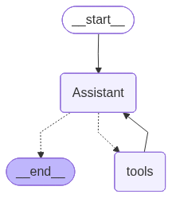

# 🤖 GitHub Project Builder Agent with LangGraph

This project implements a **multi-agent system** using [LangGraph](https://github.com/langchain-ai/langgraph), designed to help users **search GitHub for repositories, analyze them, and provide coding assistance**.  

The architecture is powered by a **Supervisor Agent** that coordinates specialized sub-agents:
- 🔍 **Agent (assistant)** – finds relevant repositories based on user requests, analyzes repositories, debugs, and optimizes code.
- 🛠️ **Github MCP server** – mcp server with a bunch of tools to give the agent the ability to execute tasks in github.
 

---

## 🚀 Features
- 🔍 Search for GitHub repositories related to a project idea.  
- 🛠️ Analyze project structure, dependencies, and code quality.  
- ⚡ Provide debugging and optimization support (with or without a repository).  
- 🧩 Modular design using LangGraph for flexibility and extensibility.  
- 🧠 LangGraph orchestration for adaptive task management.  

---

## 📌 Use Cases
- Bootstrapping new project ideas by reusing open-source code.  
- Understanding repository structures and dependencies.  
- Debugging or optimizing existing code snippets (even without a repo).  
- Educational demos for **multi-agent workflows with LangGraph**.  

---

## 🛠️ Tech Stack
- [LangGraph](https://github.com/langchain-ai/langgraph)  
- [LangChain](https://www.langchain.com/)  
- [OpenAI API](https://platform.openai.com/) (or any LLM backend)  
- GitHub API (for repository search & retrieval)  
- Python **3.11+**  

----------------------------------------------------------------------------------------------------------


----------------------------------------------------------------------------------------------------------

## 🚀 Getting Started

Follow these steps to set up and run the project:

### 1. Install Python 3.11 or higher
Make sure you have **Python 3.11+** installed:

```bash
python --version
```

2. Install dependencies
Use pip to install all required packages:

```bash
pip install -r requirements.txt
```
3. Set up environment variables
Create a .env file in the root directory and configure the necessary environment variables.

💡 Example:
---- .env.example ----


4. Enable Tracing with LangSmith
LangSmith helps trace and debug your agents effectively.
Check out the:

[tracing](https://docs.smith.langchain.com/concepts/tracing).

5. (Optional) Use LangGraph Studio
You can launch an interactive development studio for LangGraph using:

```bash
langgraph dev
```
